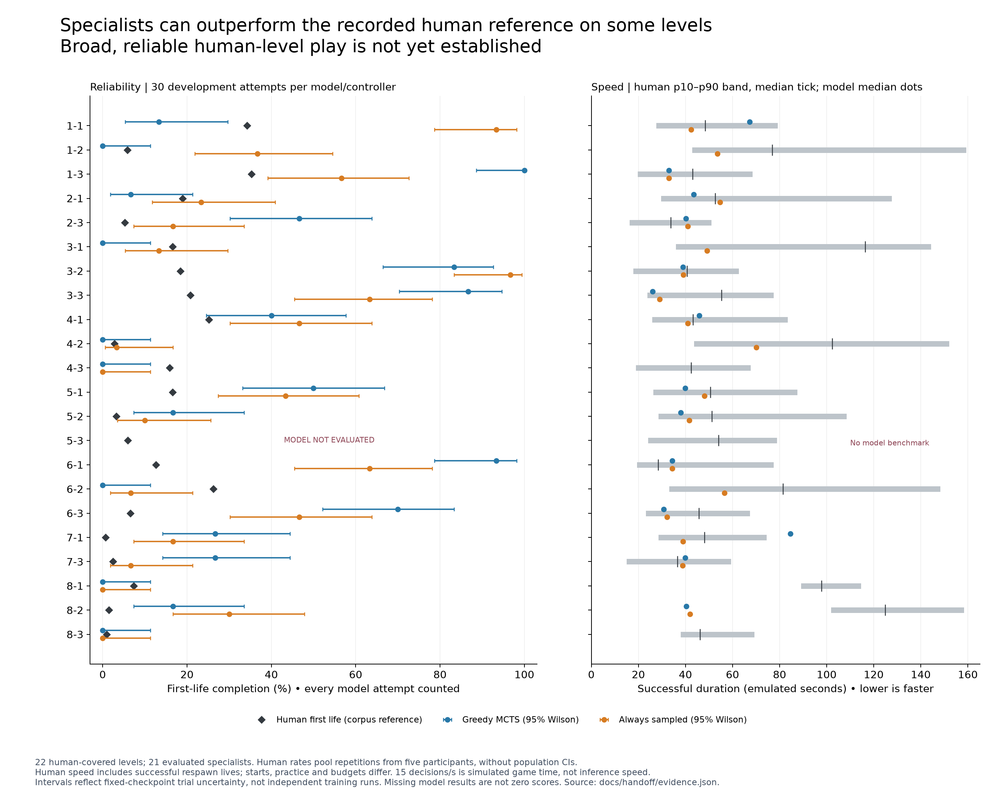
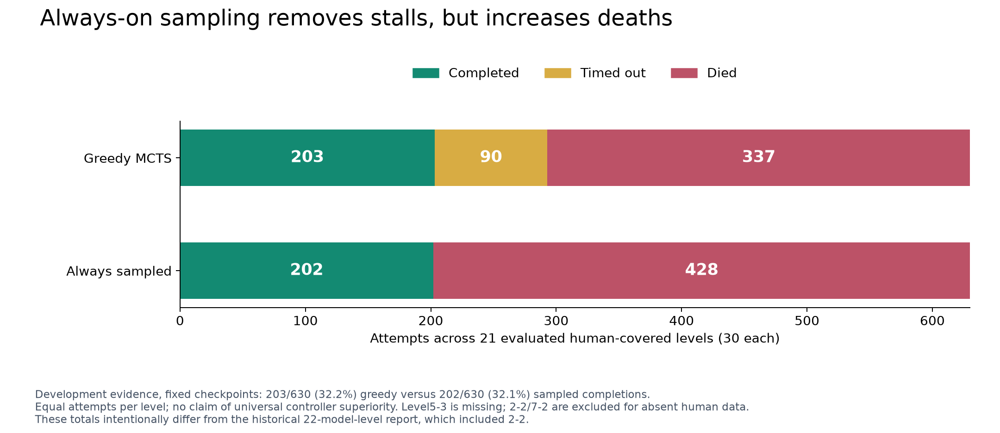
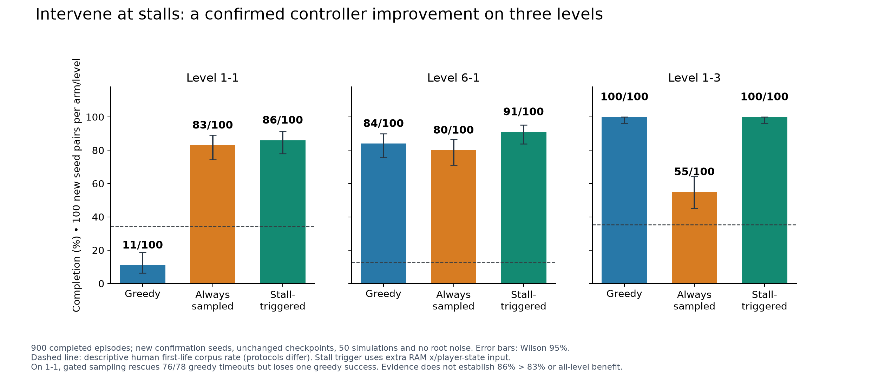
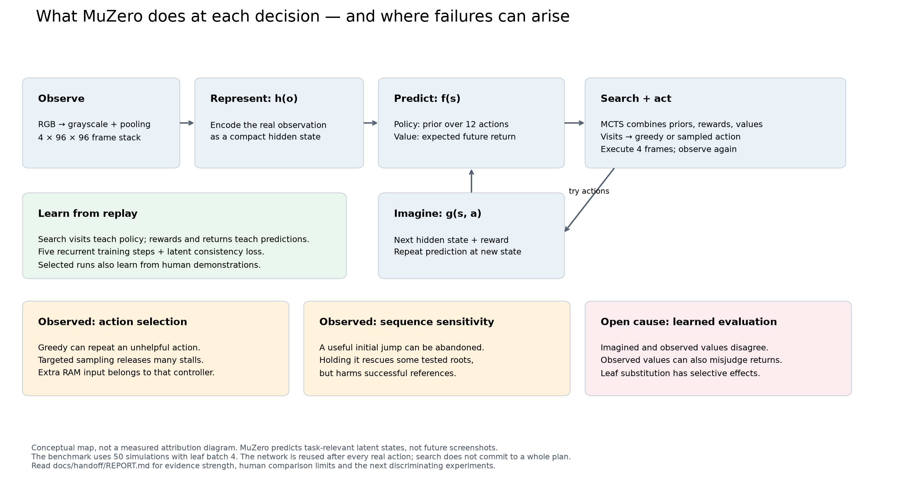
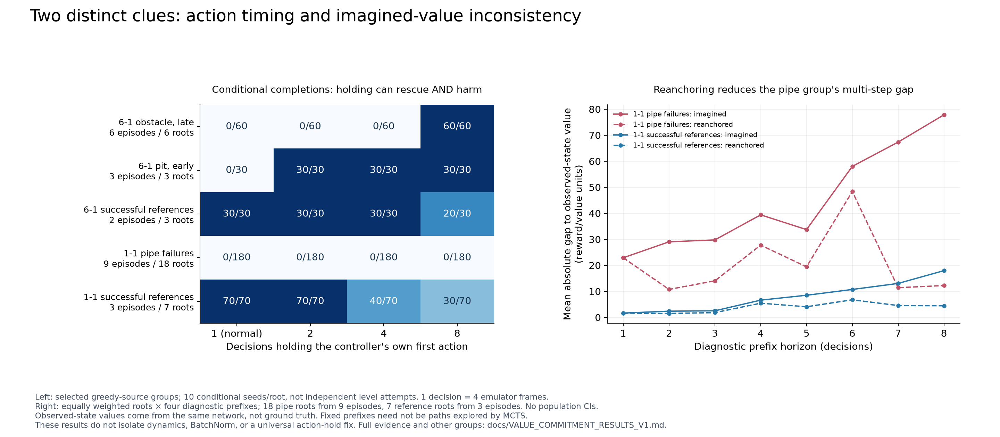
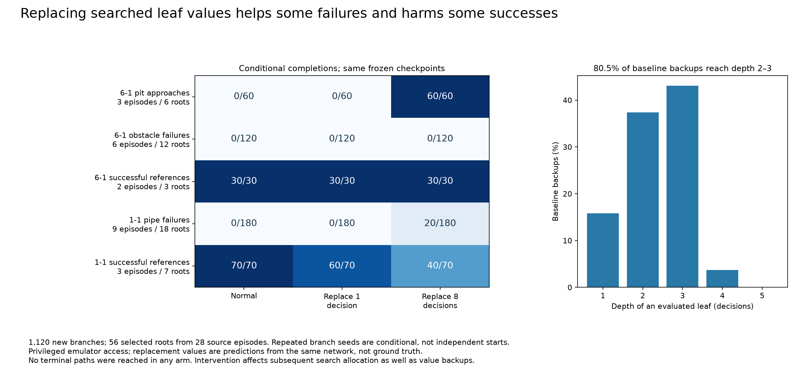
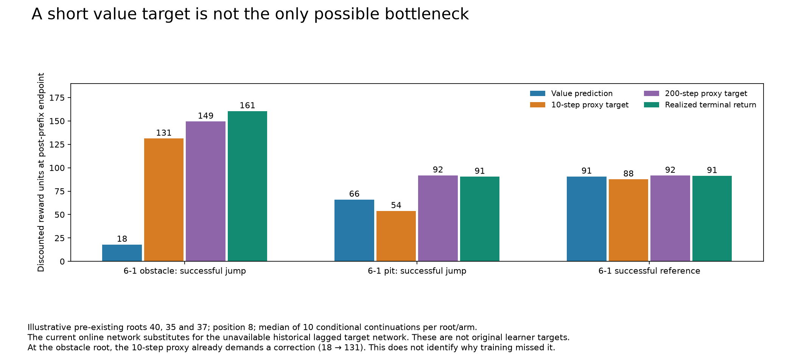

# MuZero–Mario: results, explanation and research handoff

**Evidence snapshot: 20 September 2026.** This report consolidates completed experiments; it does not describe new training. Start here for the scientific story, use [HANDOFF.md](HANDOFF.md) to resume the work, and consult [evidence.json](evidence.json) for the performance snapshot and source hashes. Completed follow-ups are in [diagnostic_evidence_20260920.json](diagnostic_evidence_20260920.json); [STATUS.md](STATUS.md) is the authoritative experiment registry.

## What we have achieved

The project has built a working MuZero system for NES Super Mario Bros, trained a fleet of level specialists, incorporated human demonstrations, packaged models for downstream representation analysis, and developed reproducible tests that distinguish stalled control from other failures. Some specialists play their own levels reliably and finish successful attempts quickly. The main unresolved problem is **reliable performance across the human-covered level set**, with a clear explanation of why planning fails when it does.

The strongest recent result is a controller intervention, with unchanged model weights: sampling briefly when Mario stalls increases Level1-1 completion from **11/100 to 86/100** on new confirmation seeds. It preserves 100/100 completions on the Level1-3 control and increases Level6-1 from 84/100 to 91/100. The intervention uses RAM-derived position and player state, so this is a result for an augmented controller, not an improvement in the visual network alone.

The mechanistic investigations provide evidence for several different limitations. Some failures are released by changing action selection. Others require sustained or precisely timed actions. At particular pipe failures, values predicted after imagined transitions differ substantially from values obtained by observing the real resulting state. These findings motivate targeted tests; they do not establish that one defective component explains the whole fleet.

## What “human-level” means here

The human reference is CNeuroMod gameplay from five participants playing inside an MRI scanner, rather than expert speedrunners or a representative population of all Mario players. The source recordings are at 60 Hz and cover 22 levels. [CNeuroMod dataset documentation](https://docs.cneuromod.ca/datasets/mario.html).

Active eligibility is defined by **available human gameplay**, not human success or model success. Levels 2-2 and 7-2 are excluded; castle stages are outside this corpus. Level5-3 has human data and an incomplete trained model, but no `best.pt` in the selected performance benchmark. It remains a visible missing result. See [scope](../HUMAN_LEVEL_SCOPE.md).

A defensible comparison needs several dimensions:

| Dimension | Current measurement | What it tells us / limitation |
|---|---|---|
| Reliability | Model first-life completions / all attempts; human first-life completions / repetitions | Closest available life-budget comparison; human practice histories and starts still differ |
| Speed | Duration conditional on success | Useful efficiency context; excludes failures, and human successful segments include respawn lives |
| Coverage | Per-level results across the human-covered set | Prevents good performance on easy levels hiding absent or failed levels |
| Robustness | New environment/search seeds for fixed checkpoints | Measures sensitivity to the tested starts; not variation across independently trained agents |
| Generality | Specialist versus multi-level model | A fleet of specialists is not one agent that has learned all levels |
| Behaviour | Human actions, policy probabilities, search visits and executed actions | Helps explain differences; aggregate agreement does not establish human-like decisions on matched states |

**Current conclusion: human-level performance across the task has not been established.** Some model point estimates exceed the recorded human reference. That can coexist with severe failures elsewhere and an easier or different evaluation protocol. No single “percentage of human performance” is reported: near-zero human completion rates make ratios unstable, and pooling would hide which levels are missing.

For a future formal claim, predeclare the target population, level weights, start/life/time budgets, controller inputs, and an acceptable non-inferiority margin before evaluating. Report per-level rates and a fixed macro-average, participant-aware human uncertainty, model training-seed uncertainty, and successful speed separately. The current human rates pool repetitions within five people; they are descriptive corpus references, not independent-person confidence intervals.

## Current performance across levels

[Vector PDF](../../images/handoff/01_human_context.pdf) · [Editable SVG](../../images/handoff/01_human_context.svg) · [Numbers](../../images/handoff/benchmark.csv)

The broad comparison uses 30 development attempts per controller on each of 21 evaluated human-covered levels: 50 MCTS simulations, leaf batch four, no root Dirichlet noise, stochastic starts and a 2,000-decision cap. Greedy chooses the maximum-visit action; sampled control uses visit temperature 0.25. Both use the same frozen checkpoint per level. Blue/orange error bars are Wilson 95% intervals for fixed-checkpoint completion rates. They do not capture checkpoint selection or training-run variation.

The human diamond is first-life completion. Grey duration bands show the human successful p10–p90 range and median; model dots show successful medians. Game-time conversion uses four emulator frames per decision at 60 Hz, or 15 decisions per second. This is **emulated time**, not wall-clock inference throughput. The human duration distribution includes successful respawn lives and is not perfectly start-matched to model trials. Some human durations exceed the model's 2,000-decision limit.

Greedy has at least one success on 14/21 levels; sampled control does on 18/21. Both are 0/30 on 4-3, 8-1 and 8-3. Level5-3 is **not evaluated in this benchmark**, rather than assigned a fabricated 0/30. At n=30, zero successes still allows a Wilson upper endpoint of approximately 11.4%; it is not proof that success is impossible.

Greedy point estimates exceed the human first-life reference on 12/21 comparable levels, sampled estimates on 16/21. These are descriptive counts, not significance tests or a human-level declaration. The per-level display matters more than those counts.

On the active 21-level set, greedy completes **203/630 (32.2%)**, versus **202/630 (32.1%)** for always-sampled control. Sampling eliminates **90 timeouts** but increases deaths from **337 to 428**. It broadens the set of levels with occasional success without improving overall reliability in this sample.

These totals supersede the historical *scope*, not the underlying experiments. The older investigation report counted 22 **model** levels, including 2-2, and reported 203/660 versus 205/660. The current human-covered analysis excludes that level. Do not mix either development total with later confirmation trials.

## The strongest confirmed improvement

The fixed stall controller monitors a 96-decision position window. When the x span is at most 16 pixels, it permits up to 32 decisions sampled at temperature 0.25, then returns to greedy control and resets the window. It can stop a burst when player control changes or the episode ends. It uses additional RAM information outside the image-based network.

| Level | Greedy | Always sampled | Stall-triggered | Stall-triggered 95% Wilson interval |
|---|---:|---:|---:|---:|
| 1-1 | 11/100 | 83/100 | 86/100 | 77.9–91.5% |
| 6-1 control | 84/100 | 80/100 | 91/100 | 83.8–95.2% |
| 1-3 control | 100/100 | 55/100 | 100/100 | 96.3–100% |

All 900 planned episodes completed, with exact pre-intervention greedy/gated agreement checked for all 300 pairs. On 1-1, the gated controller rescues 76 of 78 greedy timeouts but loses one greedy success; the remaining two timeouts become later deaths. All seven 6-1 timeouts are rescued, with all 84 greedy successes retained. The 1-3 result demonstrates why continuously sampling can be costly even when it solves stalls elsewhere.

This supports a practical improvement on these frozen checkpoints and tested starts. It does not establish that 86/100 is better than 83/100 on 1-1, eliminate early deaths, or establish an all-level benefit. The confirmation seeds are now consumed; tuning on them would require a new untouched confirmation set. [Full audited results](../STALL_SAMPLING_CONFIRMATION_RESULTS_V1.md).

## How this MuZero works

MuZero plans using a learned internal state. Its representation network encodes observations; its dynamics network predicts a next hidden state and immediate reward for an action; its prediction network supplies an action prior and an estimate of future return. Tree search uses these predictions to evaluate alternatives. The internal model is trained for useful reward, value and policy predictions, rather than reconstructing screenshots. [Original MuZero paper](https://www.nature.com/articles/s41586-020-03051-4).

In this implementation:

1. **Observe.** RGB frames become 84×84 grayscale, with consecutive-frame max pooling, four temporal channels and edge padding to 96×96. One action ordinarily lasts four emulator frames. Use the existing preprocessing helper; matching the tensor shape alone does not ensure matching temporal alignment.
2. **Represent and predict.** The specialist recipe uses the medium network: 192-channel, 6×6 hidden states and ten dynamics blocks. Policy outputs cover 12 discrete button combinations; value estimates discounted future shaped reward, not the probability of winning.
3. **Search.** MCTS allocates simulations using prior probabilities and backed-up reward/value estimates. The benchmark uses 50 simulations and evaluates leaves in batches of four. The root visit distribution is distinct from the policy-head probability distribution.
4. **Act and replan.** The controller selects one root action, executes it, and searches again from the next actual observation. It does not commit to an entire imagined sequence. This makes later abandonment of a useful jump a plausible failure mode.
5. **Learn.** Replay supplies observations, actions, rewards and search targets. Training includes a root prediction and five recurrent unroll steps, policy/reward/value losses, and latent consistency. Policy loss is root loss plus the **mean** recurrent loss; five imagined steps do not automatically mean fivefold policy-head influence. Selected experiments add human demonstration pretraining and replay mixing.

The specialist launcher overrides generic defaults, notably `model=muzero_mario_medium`, discount 0.999, completion bonus 200 and 50 simulations. Read each checkpoint's `cfg_snapshot`; today's defaults are not a specification of every historical run. Reward units, frame counts, decisions, learner updates and environment steps are different quantities.

## Terms used in the diagnostics

| Term | Plain-language meaning |
|---|---|
| Policy prior | The network's initial preference over actions, before search |
| Search visits | How often simulations explored each root action; the controller turns these counts into a choice |
| Root / leaf | The current decision state / an endpoint evaluated during tree search |
| Value / return | Predicted / realized future reward, with later rewards discounted; neither is a completion percentage |
| Reanchoring | Restarting one imagined transition from the encoded actual previous observation, instead of continuing a long imagined chain |
| Conditional branch | A replay started at an already selected situation to test an intervention; it does not sample a new full-level start |
| Paired rescue / loss | An intervention succeeds where its matched baseline fails / fails where that baseline succeeds |

## Where the deficits can be attributed

The left panel shows **conditional branches from selected states**, not new full-level evaluations. Ten repeated branch seeds at the same root do not create ten independent starting situations. The right panel compares imagined values with values after encoding corresponding actual emulator observations; neither is ground truth.

| Candidate explanation | Evidence | Supported interpretation and remaining uncertainty |
|---|---|---|
| Action selection causes some stalls | Changing the controller, with weights fixed, releases timeouts; gated benefit replicates on new seeds | Strong evidence that these stalls depend on action selection; not proof the network has an accurate world model |
| Deterministic tie-breaking contributes locally | At 17 early staircase roots, visits tie, plain right wins, and the policy prior favours right+jump at 15/17 | A specific local mechanism; high tie rates also occur on a successful control, so ties alone are insufficient |
| Useful actions are not sustained | At six late 6-1 obstacle roots, holding the controller's own first action for eight decisions yields 60/60 completions versus 0/60 for holds 1/2/4 | Direct intervention evidence for action-sequence sensitivity at those states; does not identify why subsequent decisions are poor |
| Longer commitment is a general fix | A successful 6-1 reference changes from 10/10 completions to 10/10 deaths under an eight-decision hold; 1-1 references are also harmed | Contradicted as a blanket fix; timing and state matter |
| Wrong initial action | All tested holds at 1-1 pipe failures remain 0/180; prior forced jumps avoided those local deaths, though most episodes later timed out | Persisting with the selected action cannot replace choosing a suitable one; avoiding one obstacle is not completing the level |
| Multi-step imagined valuation is inconsistent | Pipe-root mean absolute imagined/observed gap grows from 22.9 at one step to 77.8 at eight; one-step reanchoring reduces the latter to 12.3 | Strong diagnostic discrepancy. The subsequent actual-path intervention below establishes selective behavioural effects; the eight-step prefix gap is not itself a measurement of error at searched depths |
| Value estimation after actual observations is also limited | A successful 6-1 continuation has real-observation endpoint value 18.0 but realized full discounted return 161.2 | Replacing imagined states need not solve valuation; these quantities use a specified intervention continuation, not the network's training-policy target |
| Policy head is globally state-independent | Shuffling state/prior pairings worsens target agreement across all four probed levels | Evidence against that broad explanation; local bad decisions and self-referential targets remain possible |
| Imagined policy gradients overwhelm real-root learning | Fresh-data median recurrent/root policy-head norm ratios on 1-1 are 0.812 greedy and 0.924 sampled, with positive alignment in all 16 batches | Does not support this specific hypothesis in the probe; historical replay and other training losses were not measured |
| BatchNorm causes the failures | Changing normalization statistics changes predictions on failing and successful controls | Sensitivity is established; causal blame or a deployable normalization repair is not |

Evidence details: [controller probes](../CONTROLLER_POLICY_RESULTS_V1.md), [completed controller investigation](../CONTROLLER_INVESTIGATION_RESULTS_20260911.md), [gradient probes](../POLICY_GRADIENT_RESULTS_V1.md), [failure branches](../FAILURE_BRANCHES_RESULTS_V1.md), [value/commitment results](../VALUE_COMMITMENT_RESULTS_V1.md).

The value/commitment study audited 1,680 new branches and 56 roots: 46 roots from 23 failed source episodes plus ten reference roots from five successful episodes. The preceding failure-branch study audited 4,620 branches. Those large branch counts should never be presented as equally large independent gameplay samples. Successful references are essential: value discrepancies can also occur in successful play, and interventions can destroy success.

## Follow-up: values on actual searched paths

The completed follow-up replaces only the leaf value entering backup with the same frozen network's prediction on an actual emulator observation reached by the searched action path. This is privileged diagnostic access. All 1,120 new branches and 56 selected roots were audited; overwritten search metadata was recovered by short replay against saved traces and caches.

Eight-decision substitution rescues **60/60 selected 6-1 pit branches** across three source episodes and six roots, but leaves the obstacle branches at **0/120**. Successful 6-1 references remain 30/30. On 1-1 pipes it changes 0/180 completions to 20/180, with 90 deaths and 70 timeouts; 1-1 successful references fall from 70/70 to 40/70. This establishes a selective effect of searched-state valuation, not a universal repair or whole-level performance gain.

Of 224,000 baseline backups, **80.5% reached depth two or three**, with maximum depth five. No actual search path reached an emulator terminal in any arm. Terminal-value replacement therefore cannot explain the measured effects. The older eight-step prefix probe goes beyond these searched depths. Changing backups also changes subsequent search allocation; it does not isolate dynamics from representation or value-head effects. [Full results](../SEARCH_LEAF_VALUES_RESULTS_V1.md).

## Follow-up: does the training target demand a correction?

The value-target audit completed all **2,800 reused records from 56 roots**, confirmed by its complete summary and successful scheduler exits. It reconstructs targets at horizons 1/10/50/100/200 with the frozen **online** network as a proxy for the unavailable historical lagged target network. These are not historical learner targets or new performance trials.

At the selected late 6-1 obstacle endpoint after a successful prescribed jump (root 40, position eight), prediction is approximately **18**, the 10-step proxy target **131**, and realized terminal tail return **160**. The existing short target could therefore supply a corrective signal on this observed continuation. At an early pit example (root 35), the corresponding 10-step target is approximately **54**, below prediction **66**, while terminal return is approximately **91**. The successful reference illustrates a much smaller discrepancy. These examples argue against a single explanation for all signatures; they do not determine what states the original learner sampled or why it failed to fit them.

The plotted quantities use the post-prefix endpoint, so their returns differ from earlier tables measured at the original root. All plotted tails reach a true terminal. Across the full audit, timeout tails are finite sums and must remain separate from terminal returns. Ten repeated seeds per root/arm are conditional repetitions. [Audit protocol](../VALUE_TARGET_AUDIT_V1.md), [portable summaries](diagnostic_evidence_20260920.json).

## Human actions, policy and search

This existing figure complements the new results: it averages 21 comparable levels with equal level weights, preserving participant weighting for humans and episode weighting for models. Greedy and sampled trajectories remain separate. All outcomes are included, and 5-3 is excluded from this particular merged comparison because model traces are absent.

Read the distributions as three different objects: observed human action labels, model policy softmax probabilities, and raw search-visit probabilities on the same logged model states. An average soft probability is not an executed-action frequency. Human and model state visitation differ; similarity here is not matched-state action accuracy. The [action-choice figures](../../images/action_policy_search/action_choices_by_level.pdf) instead compare hypothetical head argmax with actually executed search actions; they are not policy-only rollouts. [Full methods and per-level figures](../ACTION_POLICY_SEARCH_DISTRIBUTIONS.md).

## How the project reached this point

| Stage | Achievement | Status / qualification |
|---|---|---|
| Core system and initial diagnostics | Parallel self-play, batched inference/search, replay learning, checkpoint replay and human comparison | Implemented; historical runs used several evolving recipes |
| T6/T9 specialists | Per-level training expanded to all 22 human-covered levels, plus a historical 2-2 model | Archived export contains 23 checkpoints, including incomplete 5-3; representation coverage is not competence |
| Human imitation rescues | Demonstrations enabled success on several levels that self-play did not solve | Mixed training provenance must remain visible, especially for brain/behaviour comparisons |
| T7 multi-level curriculum | Human/no-human arms each reached 60M environment steps | Historical pooled terminal self-play rates 0.11 versus 0.02; noisy training metrics, not matched held-out human comparison; per-level n=1 read needs replication |
| T8 specialist distillation | Teacher trajectory dumper and corpora exist | No completed student distillation result established in this handoff; successful teacher coverage/quality must be audited |
| T10 lesion studies | Component and search-budget perturbation machinery plus pilots | Useful hypotheses; small-cell baselines and limited levels do not support a fleet-wide component ranking |
| Controller and failure investigations | Broad development coverage, independent three-level confirmation, exact replay branches, value/commitment evidence | Strongest recent results, summarized above |
| Actual search-path leaf-value substitution | 1,120 new branches, 56 roots, all outcomes audited and metadata recovered | Selective rescue of pit failures; obstacle failures persist and some successful references are harmed |
| Reconstructed value-target audit | 2,800 existing branch records, 56 roots, completed summary and scheduler audit | Current-online bootstrap proxy; at some useful states the 10-step rule already demands a substantial value correction |

Historical training and packaging facts come from [BACKLOG.md](../../BACKLOG.md) and the [bundle guide](../../scripts/_bundle_README.md). Those files contain earlier status sections; the newer completed result documents control interpretation of the controller studies. The archived fleet distinguishes pure self-play, imitation-trained and incomplete models. Training on the same participants whose brain activity will be analysed is a potential interpretation confound, not an interchangeable provenance detail.

## What still needs to be done

1. **Use the completed value-target audit to choose the next controlled pilot.** Compare residuals by failure signature and successful controls, retaining source-episode grouping. Distinguish a target that fails to provide a signal from a target that already demands correction. Original learner replay and the lagged target network were not saved, so reconstructed targets cannot establish historical training causes. [Executable experiment cards](NEXT_EXPERIMENTS.md).
2. **Establish broad controller reliability.** Predeclare a candidate and evaluate all 22 eligible levels, including an explicitly labelled `latest.pt` evaluation for incomplete 5-3. Reserve new seeds after any tuning. Keep model selection data separate from confirmation, and report completion/death/timeout plus intervention cost and extra inputs. This turns a three-level rescue into an answer about breadth.
3. **Make the human comparison protocol explicit.** Rebuild matched first-life duration summaries, preserve participant/session structure, examine practice phase, and align life/start/time definitions as closely as the recordings permit. Retain unmatched corpus references as context. Avoid an unqualified human-level headline until these choices are fixed.
4. **Use the mechanism result to select a training change.** If searched imagined values are implicated, test a targeted correction against unchanged baselines with multiple training seeds. If harmful action switching dominates, test state-sensitive commitment rather than globally holding actions. Keep successful levels as controls. Do not remove BatchNorm or rebalance losses solely from the current correlations.
5. **Answer generalization separately.** Replicate T7 per-level evaluation at more than one rollout; audit both specialist corpora before T8. Compare a distilled student, specialists and both curriculum arms under the same evaluation protocol and budgets. A multi-level student is a distinct deliverable from stronger specialists.
6. **Preserve a usable handoff.** Archive checkpoint/config/source hashes, manifests, traces, human conversion metadata and these reports together. Confirm preprocessing frame rate for downstream users. Recover exact source-frame counters before internal TR-aligned analysis from the converted corpus; the model bundles already support users who supply their own correctly sampled frames.

The deliverable is a credible account of partial competence, a replicated practical improvement, and increasingly specific failure tests. The remaining scientific question is which interventions improve reliability broadly while preserving successes, and whether they correct learned planning rather than compensating for it externally.
